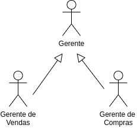

# LAB: Estudo de Caso - Descrevendo Casos de Uso de um Sistema de Apoio à Saúde Mental

Este estudo de caso concentra-se nos requisitos de um sistema denominado _Mentcare_. É comum o uso deste tipo de sistema, por exemplo, em hospitais do Reino Unido e Escócia. O mesmo é utilizado em clínicas que atendem pessoas com transtornos mentais, registrando detalhes das consultas e condições dos pacientes.

# Passo 1: Contexto do Sistema _Mentcare_

Este sistema é separado de um sistema de registros de pacientes mais geral, visto que, informações mais específicas devem ser mantidas. Além disso, o sistema deve ser configurado para gerar documentos e relatórios de diferentes tipos, visando garantir que as leis pertinentes à saúde mental sejam respeitadas pela equipe de está atendendo os pacientes.

Este é um sistema crítico de segurança, pois uma falha pode levar a decisões que comprometam a segurança do paciente ou da equipe médica. Existem também considerações importantes de segurança e privacidade que devem ser levadas em consideração no sistema Mentcare. Por exemplo, o vazamento de dados pode expor pacientes, como ocorreu com a [rede finlandesa de terapia Vastaamo](https://www.bbc.com/portuguese/geral-54698957).

**Tarefa:** Reúna-se com o seu grupo para ler e compreender as funcionalidades e demais características do sistema, que são descritas nas próximas seções.

## Principais Funcionalidades:

* **Cuidados individuais:** Os médicos podem criar registros para pacientes, editar as informações no sistema, visualizar o histórico do paciente, etc. 

* **Monitoramento do paciente:** O sistema monitora regularmente os registros dos tratamentos dos pacientes, emitindo alertas caso sejam detectados possíveis problemas. Por exemplo, se um paciente não foi ao médico por algum tempo, um aviso pode ser emitido. Um dos elementos mais importantes do sistema de monitoramento é acompanhar os pacientes que foram submetidos a um tratamento involuntário (isto é, detidos em um hospital sem o seu consentimento). O sistema deve gerenciar os pacientes que foram detidos e garantir que todos os processos legais necessários sejam seguidos e documentados no momento certo.

* **Emissão de relatórios:** O sistema gera relatórios gerenciais mensais, mostrando o número de pacientes atendidos em cada clínica, o número de pacientes que entraram e saíram do sistema de atendimento, o número de pacientes internados, os medicamentos prescritos e seus custos, etc.

## Usuários:

Quatro tipos de usuários podem utilizar o sistema _Mentcare_:

* **Equipe clínica:** A equipe clínica interage diretamente com o sistema, consultando e modificando as informações do paciente. Eles se preocupam principalmente em manter um histórico de consultas e registrar o tratamento e a medicação prescrita aos pacientes.

* **Secretaria:** A equipe da secretaria interage diretamente com o sistema, em conjunto com um sistema geral para registrar informações sobre agendamentos de pacientes. Esta equipe precisa registrar quando as consultas foram marcadas, a data da consulta e se os pacientes compareceram ou não às consultas. Os membros da secretaria também são responsáveis por gerar relatórios para o gerenciamento da clínica médica.

* **Administrador de Sistema e Gerente de Registros:** A equipe de registros médicos é responsável por garantir a integridade e segurança geral dos dados no sistema. Eles também são responsáveis por integrar o sistema com outros sistemas de registro de pacientes, compartilhando informações quando necessário. Neste contexto, o administrador de sistema é responsável por garantir a segurança e a integridade do sistema. O gerente de registro médico é responsável por garantir que o sistema esteja em conformidade com os requisitos legais sobre informações pessoais.

* **Gerente de serviços de saúde:** O gerente dos serviços de saúde não interage diretamente com o sistema. Em vez disso, o gerente utiliza relatórios de consultas, diagnósticos e tratamentos. A criação destes relatórios é iniciada pela equipe de registros médicos. Os relatórios são gerados automaticamente pelo sistema e não contêm informações pessoais do paciente. Logo, os gerentes não têm acesso às funcionalidades clínicas do sistema ou aos prontuários individuais dos pacientes.

## Observações:

* Podemos observar que a confiabilidade do sistema é um requisito importante, assim como a segurança.

* Existem alguns conflitos entre os requisitos de privacidade do paciente e os requisitos para manter a segurança do paciente e dos cuidadores.

* Como em todos os sistemas médicos, a privacidade é um requisito crítico do sistema. É essencial que as informações do paciente sejam confidenciais e nunca sejam divulgadas a ninguém além da equipe médica autorizada e do próprio paciente. Os gerentes hospitalares não devem ter acesso às informações individuais dos pacientes.

# PASSO 2: Relembrando conceitos sobre casos de uso

Consulte a [Seção 3.4](https://engsoftmoderna.info/cap3.html#casos-de-uso) do livro de Engenharia de Software Moderna sobre Casos de Uso e o material disponível no Canvas da disciplina.

# PASSO 3: Identificando os casos de uso

Converse com o seu grupo para listar os **principais casos de uso** do sistema. 

Considerando que já identificamos os atores dos sistema, podemos utilizar um conjunto de perguntas como guia para a elaboração dos casos de uso: 

* Quem é(são) o(s) ator(es) primário(s) e o(s) ator(es) secundário(s)?
* Quais são as metas do ator?
* Que precondições devem existir antes de uma história começar?
* Que tarefas ou funções principais são realizadas pelo ator?
* Que exceções deveriam ser consideradas à medida que uma história é descrita?
* Quais são as variações possíveis na interação do ator?
* Que informações de sistema o ator adquire, produz ou modifica?
* O ator terá de informar o sistema sobre mudanças no ambiente externo?
* Quais informações o ator deseja do sistema?
* O ator gostaria de ser informado sobre mudanças inesperadas?

Em seguida, os **casos de uso devem ser priorizados**, isto é, o grupo deve definir quais são os casos de uso mais relevantes para a construção do sistema. O objetivo é organizar as etapas para o desenvolvimento do projeto. É importante que os casos de uso descrevam cenários sucintos e bem definidos.

Lembre-se que apesar de escritos pelos desenvolvedores do sistema, casos de uso devem ser entendidos e validados pelos usuários. Concentre-se nos principais casos de uso do sistema.

# PASSO 4: Descrevendo os casos de uso

Escolha e detalhe pelo menos quatro casos de uso identificados, incluindo precondições, o fluxo normal e as extensões, se existirem.

# PASSO 5: Criando o diagrama de casos de uso

## Representando os atores

A UML define o __[Diagrama de Casos de Uso](https://engsoftmoderna.info/cap3.html#diagramas-de-casos-de-uso)__, que consiste em um sumário gráfico para os casos de uso do sistema. Este diagrama mostra os **atores**, os **casos de uso**, e os **relacionamentos** entre eles.

Os papéis dos usuários são modelados através de atores (pequenos bonecos).

Se existem muitos atores do sistema, você pode agrupá-los em atores genéricos, que compartilham características comuns. Estes atores são conectados por meio de herança. No exemplo abaixo, o "Gerente de Compras" e o "Gerente de Vendas" tem aspectos em comum, sendo agrupados no ator "Gerente".

Neste passo, o seu grupo deve verificar e organizar os atores do sistema. Em seguida, adicione estes atores no diagrama.

## Representando os casos de uso:

Representamos os casos de uso do sistema como elipses no diagrama. Neste passo, você deve adicionar as **elipses** referentes aos casos de uso criados.

## Relacionamentos:

As notações UML podem variar conforme os autores. Nas nossas aulas, vamos seguir as notações definidas pelo livro UML Essencial e pelo livro de [Engenharia de Software Moderna](https://engsoftmoderna.info/).

Normalmente, utilizamos uma **ligação sem direção** para representar a **comunicação entre atores e casos de uso**. Entretanto, a UML também define outros tipos de relacionamentos:

* `<<include>>`: quando queremos deixar explícito que um caso de uso **inclui** outro. O livro de Engenharia de Software Moderna mostra um [exemplo](https://engsoftmoderna.info/cap3.html#diagramas-de-casos-de-uso), em que "Transferir valores" inclui o caso de uso "Autenticar clientes".

* `<<extend>>`: Dizemos que um caso de uso A estende um caso de uso B, quando a execução de B é opcional. Em outras palavras, se A é executado, B **poderá** será executado também (talvez não seja). Entretanto, estas derivações de relacionamentos podem demandar tempo, trazendo poucos benefícios para o projeto. Conforme mencionado por Fowler, devemos nos concentrar "na descrição
textual de um caso de uso; é aí que reside o valor real da técnica". Portanto, **não vamos utilizar o relacionamento "extend"** nos nossos diagramas.

Neste passo, você deve adicionar os relacionamentos do diagrama. Lembre-se de adicionar um **retângulo** para delimitar o espaço do sistema.

## Referências

[Engenharia de Software Moderna](https://engsoftmoderna.info/cap3.html). Marco Tulio Valente. Capítulo 3 - Requisitos.

[Engenharia de Software](https://www.amazon.com.br/Engenharia-software-Ian-Sommerville/dp/8579361087). Ian Sommerville. 10ª edição. Capítulo 4 - Engenharia de Requisitos.

Software Engineering. Ian Sommerville. [Mentcare: A mental health support system](https://software-engineering-book.com/case-studies/mentcare/). Acesso em Fervereiro/2023.